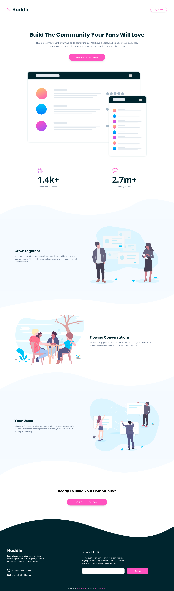
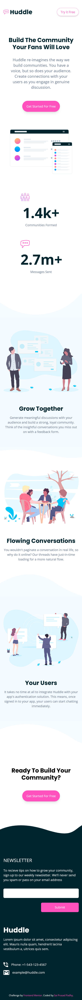

# Frontend Mentor - Huddle landing page with curved sections solution

This is a solution to the [Huddle landing page with curved sections challenge on Frontend Mentor](https://www.frontendmentor.io/challenges/huddle-landing-page-with-curved-sections-5ca5ecd01e82137ec91a50f2). Frontend Mentor challenges help you improve your coding skills by building realistic projects. 

## Table of contents

- [Overview](#overview)
  - [The challenge](#the-challenge)
  - [Screenshot](#screenshot)
      - [Desktop/Laptop](#desktop-view)
      - [Mobile](#mobile-view)
  - [Links](#links)
- [My process](#my-process)
  - [Built with](#built-with)
  - [What I learned](#what-i-learned)
- [Author](#author)
- [Acknowledgments](#acknowledgments)


## Overview

### The challenge

Users should be able to:

- View the optimal layout for the site depending on their device's screen size
- See hover states for all interactive elements on the page

### Screenshot

#### Desktop view


#### Mobile View


### Links

- Solution URL: [Github Repo](https://github.com/Padhysai/huddle-landing-page)
- Live Site URL: [https://projects.saiprasadpadhy.in/huddle-landing-page](https://projects.saiprasadpadhy.in/huddle-landing-page)

## My process

### Built with

- Semantic HTML5 markup
- Tailwind CSS
- Flexbox
- CSS Grid
- Mobile-first workflow
- CSS Positions


### What I learned

I have learnt about tailwind configuration and CSS Positions and how to implement in real-world scenerios. Also, I have learnt about responsive design using mobile first workflow using Tailwind CSS.

Learnt how to modify Tailwind Configuration to adopt project theme:

```js
tailwind.config = {
      theme: {
        extend: {
          colors: {
            pink: 'hsl(322, 100%, 66%)',
            lightpink: 'hsl(321, 100%, 78%)',
            lightred: 'hsl(0, 100%, 63%)',
            darkcyan: 'hsl(192, 100%, 9%)',
            paleblue: 'hsl(207, 100%, 98%)',
          }
        },
        fontFamily: {
          'poppins': ['Poppins', 'sans-serif'],
          'opensans': ['"Open Sans"', 'sans-serif'],
        },
        content: {
          'communities': 'url(./images/icon-communities.svg)',
          'messages': 'url(./images/icon-messages.svg)'
        }
      }
    }
```

Usage of picture tab to render images Responsively:

```html
<picture class="w-full object-cover">
    <source media="(max-width: 799px)" srcset="./images/bg-section-bottom-mobile-1.svg" />
    <source media="(min-width: 800px)" srcset="./images/bg-section-bottom-desktop-1.svg" />
    
  </picture>
```

## Author

- Website - [Sai Prasad Padhy](https://projects.saiprasadpadhy.in/)
- Frontend Mentor - [@saiprasad006](https://blog.saiprasadpadhy.in/)
- Twitter - [@saiprasadpadhy](https://www.linkedin.com/in/saiprasadpadhy/)


## Acknowledgments

Thanks Frontendmentor.io for awesome challenges which boost our confidence.
